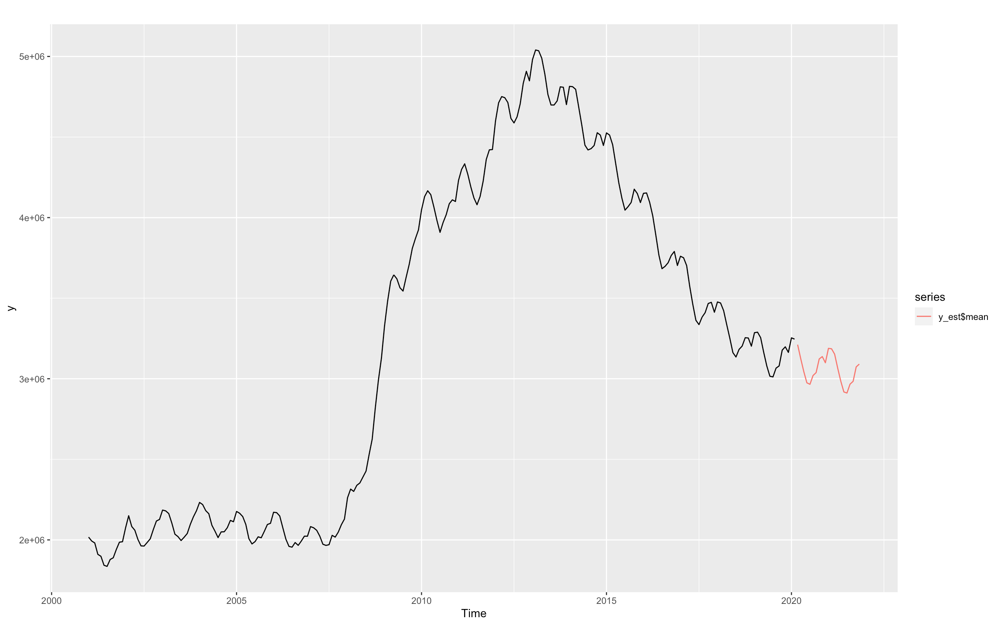

```{r setup, include=FALSE}
knitr::opts_chunk$set(echo = TRUE)
```


\newpage
\tableofcontents
\newpage


# 1. Presentación de los datos


Los datos a tratar pertenecen al número de desempleados de España a lo largo de los años. Como se puede ver en representación inferior, podemos observar diferentes épocas que ha sufrido el país en su historia más reciente.

Si empezamos por el extremo inferior que data sobre los inicios del año 2000, observamos que el empleo se mantiene más o menos constante en cuanto a tendencia, aunque se aprecia una gran estacionalidad según si estamos en los meses de invierno o verano. Este patrón se repite hasta el año 2008 donde con la gran crisis financiera mundial, el paro subió bruscamente situándose en más de 5.000.000 de personas en el año 2012.
Pasado este momento, empieza a decrecer progresivamente observándose siempre aumentos y descensos según los meses de invierno o verano respectivamente hasta finales de 2019.

En este momento, a raíz de la aparción del COVID-19, la serie rompe todos los esquemas, aumentando en muy pocos meses casi 1.000.000 de desempleados debido a la crisis sanitaria y a todas las restricciones impuestas. 
Unos meses depués, estos altos niveles de desempleo empiezan a decrecer a gran ritmo hasta situarse en el momento actual donde el ritmo de bajada ha disminuido.


```{r, include = FALSE, ECHO = FALSE}
#Carga de liberias
library(fpp2)
library(ggplot2)
library(MLTools)
library(readxl)
library(lmtest)  
library(tseries) #contains adf.test function
library(Hmisc)
library(tidyverse)
library(TSA)
library(MLTools)
library(fpp2)
library(ggplot2)
library(TSA)
library(lmtest)  #contains coeftest function
library(tseries) #contains adf.test function
library(Hmisc) #contains adf.test function
library(readr)
library(tidyverse)
```

```{r message=FALSE, warning=FALSE, echo=FALSE, include=FALSE}
fdata <- read_table2("UnemploymentSpain.dat")
# Convert to time series object
fdata_ts <- ts(fdata, frequency = 12, start = 2001)
y <- fdata_ts[,2]
```

Veamos nuestra gráfica de la evolución del paro:


```{r echo=FALSE, message=FALSE, warning=FALSE, fig.align='center', fig.dim=c(6,4), fig.cap='Evolución del paro'}
autoplot(y)
```

\newpage

# 2. Predicción

En primer lugar explicaremos el proceso que nos llevó a dar como resultado que el paro en el mes de noviembre es de **3.240.623**.

## 2.1. Análisis exploratorio

Lo primero que hicimos tras ver los datos del paro fue ver si la serie es estacionaria en varianza, es decir, que independientemente del nivel la varianza es constante. Esto lo medimos a traves de un Box-Cox como se ve en el siguiente gráfico:

```{r, echo = FALSE, warning=FALSE, message=FALSE, fig.align='center',fig.dim=c(5,3), fig.cap='Box-Cox datos'}
a = BoxCox.lambda.plot(y,12)
```

Que refleja si es necesario realizar una transformación Box-Cox. Sin embargo, vemos que la línea azul no es muy creciente y que R-square no es muy alto (R-square=0.2419). Por lo tanto, no es necesario realizar una estabilización de varianza.


## 2.2. Seasonal ARIMA

En primer lugar representamos la serie temporal junto con su ACF y PACF para inspeccionar la serie regular y estacional.
Vemos que la serie necesita una diferenciación en la parte regular ya que el ACF disminuye lentamente a lo largo del tiempo.

\newpage

```{r, echo = FALSE, warning=FALSE, message=FALSE, fig.align='center',fig.dim=c(5,3.5), fig.cap='Gráfica datos'}
ggtsdisplay(y,lag.max = 100)
```

Tras haber diferenciado en la parte regular, volvemos a mostrar el ACF y el PACF. 

```{r, echo = FALSE, warning=FALSE, message=FALSE, fig.align='center', fig.dim=c(5,3),fig.cap='Gráfica tras diff regular'}
Bz <- diff(y,differences = 1)
ggtsdisplay(Bz,lag.max = 100)
```

En la imagen superior vemos que cada 12 puntos aparece un pico y por tanto deducimos que tenemos que diferenciar en la parte estacional también.

Para posteriormente poder ajustar correctamente nuestra parte estacional del modelo, vamos a diferenciar la parte estacional y estudiar su gráfica ACF y PACF.

```{r, echo = FALSE, warning=FALSE, message=FALSE, fig.align='center', fig.dim=c(5,3), fig.cap='Gráfica tras diff estacional'}
Bz_s <- diff(Bz, lag = 12, differences = 1)
ggtsdisplay(Bz_s, lag.max = 65)
```

\newpage

Podemos ver ahora que la parte estacional ha mejorado ya que no se observan picos constantes en periodos de 12 (si es cierto que en algún múltiplo de 12 de forma puntual existe algún pico). Sin embargo, observamos cómo el ACF va decreciendo progresivamente (lo que lo asociamos a un proceso autorregresivo) y en PACF hay un coeficiente significante en el punto 12, por lo que en la parte estacional aplicamos un proceso AR(1).

```{r, echo = FALSE, warning=FALSE, message=FALSE,fig.align='center', fig.dim=c(5,3), fig.cap='Residuos del modelo' }
sarima.fit <- Arima(y,
                    order=c(0,1,0),
                    seasonal = list(order=c(1,1,0),period=12),
                    include.constant = FALSE)
ggtsdisplay(residuals(sarima.fit),lag.max = 100)
```


Ahora en los residuos podemos ver que la parte estacional parece ajustada más o menos, sin embargo; la parte regular no esta bien modelada. Para ello miramos los residuos, como va decreciendo poco a poco en ACF y vemos un coeficiente bastante significativo en el PACF, volvemos a aplicar un AR(1). Por tanto volvemos a modelar nuestros datos con la parte regular ajustada.

\newpage

```{r, echo = FALSE, warning=FALSE, message=FALSE, fig.align='center', fig.dim=c(5,3), fig.cap='Residuos del modelo mejorado'}
sarima.fit <- Arima(y,
                    order=c(1,1,0),
                    seasonal = list(order=c(1,1,0),period=12),
                    include.constant = FALSE)
ggtsdisplay(residuals(sarima.fit),lag.max = 100)
```

Tras ver como quedan los residuos, lo que haremos será ver alguna información relevante a cerca de nuestro modelo. Alguno de estos datos son datos de control y error como el RMSE o el MAE.

```{r, echo = FALSE, warning=FALSE, message=FALSE, fig.align='center'}
summary(sarima.fit)
```

También es importante ver si nuestros coeficientes son realmente significativos, esto lo miraremos con la función coeftest.

```{r, echo = FALSE, warning=FALSE, message=FALSE, results='markup'}
coeftest(sarima.fit) 
```


Obtenemos que ambos coeficientes son relevantes, por lo que podemos pasar a otro punto. Lo siguiente será ver donde caen las raices del polinomio característico. Para ver esto usaremos las inversas de las raices, las cuales si caen dentro del circulo unidad cumplirán lo que se pide para tener un proceso estacionario.

```{r, echo = FALSE, warning=FALSE, message=FALSE, fig.align='center', fig.cap='Inversas de raices', fig.dim=c(4,4)}
autoplot(sarima.fit)
```

No obstante, en la gráfica de los residuos se podía ver que estos no son perfectamente ruido blanco en la parte estacional. 

Por este motivo vamos a intentar ajustarlo de forma más precisa con un proceso MA(2).

```{r, echo = FALSE, warning=FALSE, message=FALSE, fig.align='center', fig.dim=c(5,3), fig.cap='Residuos del modelo mejorado'}
sarima.fit <- Arima(y,
                    order=c(1,1,0),
                    seasonal = list(order=c(1,1,2),period=12),
                    include.constant = FALSE)
ggtsdisplay(residuals(sarima.fit),lag.max = 100)
```
Y volvemos a comprobar los mismos elementos anteriores con el modelo final. En este caso vemos también como se comportan los residuos.

```{r, echo = FALSE, warning=FALSE, message=FALSE, fig.align='center', fig.dim=c(5,3), fig.cap='Análisis residuos '}
a = CheckResiduals.ICAI(sarima.fit, bins = 10)

```

Después miramos los otros elementos restantes:

```{r, echo = FALSE, warning=FALSE, message=FALSE, fig.align='center', fig.cap='Inversas de raices', fig.dim=c(5,5)}
autoplot(sarima.fit) 
```

Podemos afirmar que de nuevo nuestras inversas de las raíces se encuentran dentro del círculo unidad, por lo tanto podemos afirmar que es estacionario.


Vemos que el ruido generado es ruido blanco, que todas las coeficientes del modelo son relevantes y que generan unos p-valores pequeños. Además, comprobamos que el modelo genera datos predichos que se adaptan bien a los datos reales. Eso lo podemos ver en el siguiente gráfico:
  
  
```{r, echo = FALSE, warning=FALSE, message=FALSE, fig.align='center', fig.dim=c(6,4), fig.cap='Comparación ajuste'}
autoplot(y, series = "Real")+
  forecast::autolayer(sarima.fit$fitted, series = "Fitted")
```

Como podemos observar, la curva azul y la roja son muy parecidas y se adapta bien a todos los cambios. Lo que es muy satisfactorio. Por ello predecimos obteniendo el resultado enviado para el assigment


```{r, echo = FALSE, warning=FALSE, message=FALSE}
y_est <- forecast(sarima.fit, h=1)
y_est
```


## 2.3. Otros modelos intentados


Probamos también a crear otros modelos. Partimos de la base de haber diferenciado una vez tanto la parte estacionaria como la regular. Vemos que el ACF va disminuyendo de forma senoidal en la parte estacionaria, por lo que añadimos un MA(1). Tras ello, tenemos que ajustar la parte regular, añadiendo RA(2) y un MA(1).

\newpage

```{r, echo = FALSE, warning=FALSE, message=FALSE,fig.align='center', fig.dim=c(5,3), fig.cap='Modelo alternativo'}
sarima2.fit <- Arima(y,
                     order=c(2,1,1),
                     seasonal = list(order=c(0,1,1),period=12),
                     include.constant = FALSE)
ggtsdisplay(residuals(sarima2.fit),lag.max = 100)
```


Tras crear el nuevo modelo comprobamos algunas métricas relevantes como en el caso del modelo entregado.

```{r, echo = FALSE, warning=FALSE, message=FALSE}
coeftest(sarima2.fit)
summary(sarima2.fit) 
```

Tras ello comprobamos el comportamiento de los residuos:

```{r, echo = FALSE, warning=FALSE, message=FALSE, fig.align='center', fig.dim=c(6,4), fig.cap='Análisis residuos'}
CheckResiduals.ICAI(sarima2.fit, bins = 10)
```
Por último comprobamos que tal ajusta nuestro modelo con los datos:

\newpage
  
```{r, echo = FALSE, warning=FALSE, message=FALSE, fig.align='center', fig.dim=c(6,4), fig.cap='Comparación ajuste'}
autoplot(y, series = "Real")+
  forecast::autolayer(sarima2.fit$fitted, series = "Fitted")
```

Sin embargo, estos resultados a pesar de que generan ruido blanco y la mayoría de variables aparecen muy significativas, generaba resultados ligeramente peores que los del modelo anterior. Pero esto lo veremos en mayor profundidad en un apartado posterior donde compararemos todos nuestros modelos.

```{r, echo = FALSE, warning=FALSE, message=FALSE}
y_est2 <- forecast(sarima2.fit, h=1)
y_est2
```

\newpage

# 3. Nuevos modelos

## 3.1. SARIMA con Recorte Periodo de Tiempo

Para buscar una predicción más acertada a la realidad, hemos creado varios modelos nuevos. La línea de trabajo que hemos adoptado ha sido analizar la serie temporal después de la crisis de 2008, es decir; cuando los datos del paro empiezan a decrecer. De esta forma intentamos conseguir un modelo que no esté mal influido por los datos previos donde se producía un aumento del paro. 

```{r, echo = FALSE, warning=FALSE, message=FALSE, include=FALSE}
fdata_corto <- read.table("./datosCovid.txt",header = TRUE, sep = "")
# Convert to time series object
fdata_ts_corto <- ts(fdata_corto[147:250,])
y_corto <- fdata_ts_corto[,2]
```

```{r, echo = FALSE, warning=FALSE, message=FALSE, fig.dim = c(5,3),fig.align='center', fig.cap='Datos recortados'}
autoplot(y_corto)
```

Una vez tenemos estos datos, procedemos de igual forma que antes. Analizamos primero si la serie es estacionaria en varianza.

```{r, echo = FALSE, warning=FALSE, message=FALSE, fig.align='center',fig.dim=c(5,3), fig.cap='Box-Cox datos recortados'}
b =BoxCox.lambda.plot(y_corto,12)
```


Que como se puede ver en la imagen inferior la línea azul es práctiacmente horizontal y R-squared = 0.001. Por lo tanto, no es necesario realizar una estabilización de varianza mediante la tranformación Box-Cox.

Empezamos por tanto representando la serie temporal junto con su ACF y PACF para inspeccionar la serie regular y estacional.

```{r, echo = FALSE, warning=FALSE, message=FALSE, fig.align='center', fig.dim=c(5,3), fig.cap='Modelo recortado'}
ggtsdisplay(y_corto,lag.max = 100)
```

Vemos que la serie necesita una diferenciación en la parte regular ya que el ACF dismunye progresivamente por el tiempo y volvemos a mostrar el ACF y el PACF.

```{r, echo = FALSE, warning=FALSE, message=FALSE,fig.align='center', fig.dim=c(5,3), fig.cap='Modelo tras diff'}
Bz_corto <- diff(y_corto,differences = 1)
ggtsdisplay(Bz_corto,lag.max = 100)
```

\newpage

Vemos que cada 12 puntos aparece un pico y por tanto deducimos que tenemos que diferenciar en la parte estacional también.

```{r, echo = FALSE, warning=FALSE, message=FALSE, fig.align='center', fig.dim=c(5,3), fig.cap='Modelo tras diff estacional'}
Bz_corto_s <- diff(Bz_corto, lag = 12, differences = 1)
ggtsdisplay(Bz_corto_s, lag.max = 65)
```

Ahora vemos que en el punto 12, el primero de la parte estacional se produce un residuo significativo, a su vez también observamos que en el PACF se genera un coeficiente significativo en el número 12. Por ello, aplicamos un RA(1) y volvemos a representar los ACF y PACF para poder ajustar la parte regular.

```{r, echo = FALSE, warning=FALSE, message=FALSE, fig.align='center', fig.dim=c(5,3), fig.cap='Modelo parte estacional'}
arimaCorto.fit <- Arima(y_corto,
                        order=c(0,1,0),
                        seasonal = list(order=c(1,1,0),period=12),
                        include.constant = FALSE)
ggtsdisplay(residuals(arimaCorto.fit),lag.max = 100)
```

Observamos que hay dos coeficientes bastante significativos, uno en el ACF y otro en el PACF por ello aplicaremos conjuntamente un AM(1) y un AR(1).

\newpage


```{r, echo = FALSE, warning=FALSE, message=FALSE,fig.align='center', fig.dim=c(5,3), fig.cap='Modelo final'}
arimaCorto.fit <- Arima(y_corto,
                        order=c(1,1,1),
                        seasonal = list(order=c(1,1,0),period=12),
                        include.constant = FALSE)
ggtsdisplay(residuals(arimaCorto.fit),lag.max = 100)
```

Ahora miraremos un resumen de nuestro modelo junto con la significiación de los coeficientes.

```{r, echo = FALSE, warning=FALSE, message=FALSE}
summary(arimaCorto.fit)
coeftest(arimaCorto.fit) 
```


Tras ello estudiaremos y evaluaremos los residuos generados por nuestro modelo.

```{r, echo = FALSE, warning=FALSE, message=FALSE, fig.align='center', fig.dim=c(5,3), fig.cap='Revisión Residuos'}
CheckResiduals.ICAI(arimaCorto.fit, bins = 10)
```

Tras ello miramos las inversas de las raices para comprobar que nuestro proceso es estacionario.

```{r, echo = FALSE, warning=FALSE, message=FALSE,fig.align='center', fig.cap='Inversas de raices', fig.dim=c(4,4)}
autoplot(arimaCorto.fit) # root plot
```

Por ultimo vamos a comparar que tal ajusta nuestro modelo a la serie temporal sobre la que hemos trabajado. 

\newpage

```{r, echo = FALSE, warning=FALSE, message=FALSE, fig.align='center', fig.dim=c(6,4), fig.cap='Comparación Modelaje '}
autoplot(y_corto, series = "Real")+
  forecast::autolayer(arimaCorto.fit$fitted, series = "Fitted")
```


Y también veremos la predicción que nos da nuestro modelo para este mes.

```{r, echo = FALSE, warning=FALSE, message=FALSE}
y_est3 <- forecast(arimaCorto.fit, h=1)
y_est3
```


## 3.2. Regresión Dinámica

En este apartado lo que trataremos de hacer será realizar un modelo de regresión dinámica para poder predecir el paro de noviembre.

Para ello vamos a crear un nuevo conjunto de datos, donde tengamos la variable COVID donde el 0 indica que no fue periodo COVID y el 1 indica periodo COVID. Además ampliaremos el periodo COVID hasta hoy en día (como experimento). A su vez para ver mejor la gráfica inicial lo que vamos a hacer es expresar el paro en millones, por tanto un valor de 3 representa 3000000.

\newpage

```{r, echo = FALSE, warning=FALSE, message=FALSE}
fdata2 <- fdata
fdata2  <- fdata2 %>%
  mutate(indice = seq(1:250)) %>%
  mutate(covid = ifelse(indice< 231,0,1)) %>%
  mutate(TOTAL = TOTAL /1000000) %>%
  select(-indice,-DATE)
fdata2_ts <- ts(fdata2,start = 2001, frequency = 12)
```

```{r echo = FALSE, warning=FALSE, message=FALSE, fig.align='center', fig.dim=c(5.5,3.5), fig.cap='Gráfico de datos '}
autoplot(fdata2_ts)
```

Tras ello iniciaremos nuestro modelo de regresión dinámica donde tendremos como variable de salida el paro. Comenzamos con un modelo simple que usaremos para ajustar posteriormente los coeficientes.

Lo primero que veremos será la significancia de los coeficientes.

```{r, echo = FALSE, warning=FALSE, message=FALSE}
y2 <- fdata2_ts[,1]
x2 <- fdata2_ts[,2]
TF.fit <- arima(y2,
                order=c(1,0,0),
                seasonal = list(order=c(1,0,0),period=12),
                xtransf = x2,
                transfer = list(c(0,5)), 
                include.mean = TRUE,
                method="ML")
coeftest(TF.fit)
```


Obtenemos que una parte considerable de nuestros coeficientes son significantes. 

Tras ello pasamos a ver los errores, donde en caso de no ser estacionarios tendremos que diferenciar para conseguir que sea estacionario.

\newpage

```{r, echo = FALSE, warning=FALSE, message=FALSE, fig.align='center', fig.dim=c(5,3), fig.cap='Estudio de los errores'}
TF.RegressionError.plot(y2,x2,TF.fit,lag.max = 200)
```

Es bastante claro que los errores no son estacionarios, por tanto diferenciaremos.

```{r, echo = FALSE, warning=FALSE, message=FALSE, fig.align='center', fig.dim=c(5,3), fig.cap='Estudio de los errores'}
TF.fit <- arima(y2,
                order=c(1,1,0),
                seasonal = list(order=c(1,1,0),period=12),
                xtransf = x2,
                transfer = list(c(0,5)), 
                include.mean = TRUE,
                method="ML")
TF.RegressionError.plot(y2,x2,TF.fit,lag.max = 50)
```


Tras diferenciar tanto la parte regular como la estacional ya obtenemos unos errores que son estacionarios (o en gran medida).

A continuación lo que haremos será identificar los coeficientes de nuestro modelo.

```{r, echo = FALSE, warning=FALSE, message=FALSE, fig.align='center', fig.dim=c(5,3), fig.cap='Estimación de coefs'}
a =TF.Identification.plot(x2,TF.fit)
```


Para el valor de b lo que haremos será ver cuantos coeficientes no significativo hay antes del primer coeficientes significativo, que en nuestro caso será el primero. Por tanto tendremos que b = 0. Para s lo que haremos será ver cuantos coeficientes significativos desde el primero (no incluido) hay hasta que aparece el primer coeficiente no significativo, que en nuestro caso es 3. Por último para ajustar r miramos el comportamiento de los coeficientes, donde se puede ver que la caida es de tipo exponencial, por tanto tomamos r igual a 1.


Tras realizar este ajuste lo que haremos será ajustar los ordenes de las partes estacional y regular. Si volvemos a la última gráfica que mostraba los errores observamos que el ACF oscila y va decreciendo poco a poco, por lo que nos encontramos ante un proceso autorregresivo. En la parte regular tomamos un proceso AR(1) junto con un AM(1).

Ahora volvemos a realizar nuestro modelo pero ya con los coeficientes estimados y obtenemos una serie de métricas.

```{r, echo = FALSE, warning=FALSE, message=FALSE}
xlag = Lag(x2,0)   # b
xlag[is.na(xlag)]=0
arima.fit <- arima(y2,
                   order=c(1,1,1),
                   seasonal = list(order=c(1,1,0),period=12),
                   xtransf = xlag,
                   transfer = list(c(1,3)), 
                   include.mean = FALSE,
                   method="ML")
summary(arima.fit)
```

Tras un breve resumen de elementos clave veamos significancia de coeficientes, residuos, etc.

```{r, echo = FALSE, warning=FALSE, message=FALSE}
coeftest(arima.fit) 
```

Lo primero que miraremos serán los residuos de nuestro modelo, donde miraremos si estos son ruido blanco.

\newpage


```{r, echo = FALSE, warning=FALSE, message=FALSE,  fig.align='center', fig.dim=c(5,3), fig.cap='Estudio de los errores'}
CheckResiduals.ICAI(arima.fit)
```


A pesar de que un coeficiente salga un poco de la banda de confianza podemos asumir que nuestro ruido es un ruido blanco.

Veamos el gráfico CCF para comprobar correlaciones entre coeficientes a continuación.

```{r, echo = FALSE, warning=FALSE, message=FALSE, fig.align='center', fig.dim=c(5,3), fig.cap='Gráfico CCF'}
res <- residuals(arima.fit)
res[is.na(res)] <- 0
ccf(y = res, x = x2)
```


Por último vamos a ver que tal ajusta nuestro modelo la serie temporal sobre la que hemos estado trabajando en el grafico.


```{r, echo = FALSE, warning=FALSE, message=FALSE, fig.align='center', fig.dim=c(6,4), fig.cap='Diferencia Modelaje'}

y_est <- forecast(fitted(arima.fit), h=1)

autoplot(y2, series = "Real")+
  forecast::autolayer(fitted(arima.fit), series = "Fitted")
```

Vemos que nuestro modelo ajusta bastante bien la serie temporal sobre la que hemos trabajado. Si es cierto que le cuesta algo más los cambios bruscos o los picos exagerados en poco tiempo. 


No obstante, aquí se nos presenta un nuevo reto: saber cuándo tenemos que modificar la variable _x_ y volver a configurarla a 0, es decir; saber cuándo el COVID-19 ha dejado de tener efecto.
Para ello hemos entrenado un modelo ARIMA (1,1,1),(1,1,0)(12) (el mismo que usamos arriba) con datos hasta el inicio de la época COVID, febrero 2020. Una vez que lo tenemos entrenado predecimos los resultados hasta el mes de noviembre de este año, 21 valores nuevos, como se ven en la imagen.


\newpage




El valor predicho para el mes de noviembre sin tener en cuenta el factor COVID-19 es aproximadamente 3.100.000. 
La idea es comparar este valor con el valor predicho teniendo en cuenta la variable COVID, que ha sido aproximadamente 3.208.000.
Esto quiere decir que a día de hoy sigue influyendo el factor covid en el número de desempleados y por lo tanto, es correcto utilizar la variable _x = 1_ para modelar nuestro modelo.


\newpage

# 4. Comparación modelos

Una vez presentados diversos modelos para predecir el paro lo que debemos hacer es entender y conocer cual es el mejor de ello, dando puntos a favor y puntos en contra a cada uno de ellos.

Estudiaremos también la comparativa entre errores. Aunque es menos visual e intuitiva nos puede dar otro punto de vista sobre qué modelo se comporta mejor. Además, la última columna de la tabla refleja el desvío del número de paro predicho con el número real.

\begin{table}[h]
\centering
\begin{tabular}{|c|c|c|c|c|}
\hline
 $-$ & ME & RMSE & AIC & Predicción \\
\hline
SARIMA & -585,4926 & 42948,38 & 5752 & +57936\\
\hline
SARIMA2 & -920,8681 & 40813.86 & 5736 & +37559 \\
\hline
REG DIN & 1,18 & 39103,75 & -954 & +25313 \\
\hline
ARIMA REC & 221,1872 & 52421,33 & 2262 & +48710 \\
\hline
\end{tabular}
\end{table}

Como podemos ver en la tabla el modelo de regresión dinámica tiene mejores valores que el resto en todos los aspectos. Este modelo tiene errores muy pequeños ya que se adapta de gran manera al valor real. Esto ha provocado que haya sido el modelo que más se ha acercado al número total del parados del mes de agosto. Por todos estos motivos, podemos decir sin dudar, que el mejor modelo ha sido el de Regresión  dinámica.

Pero no toda la comparación se debe centrar en los errores, también nos debe interesar el como se ajusta a la serie de partida los diferentes modelos.

Esto último lo vamos a ver a través de sus predicciones y modelado de la serie temporal.

```{r, echo = FALSE, warning=FALSE, message=FALSE, fig.align='center', fig.dim=c(6,4), fig.cap='Diferencia Modelaje'}

autoplot(y, series = "REAL")+
  forecast::autolayer(fitted(sarima.fit), series = "SARIMA")+
  forecast::autolayer(fitted(sarima2.fit), series = "SARIMA2")+
  forecast::autolayer(fitted(arima.fit)*1000000, series = "REG_DIN")
```

En la gráfica superior podemos observar que cada modelo se ajusta de manera distinta a la serie temporal. Es cierto que todos tienen una alta precisión pero en función de nuestras necesidades será mejor uno que otro. 

Por ejemplo en el caso del modelo de regresión dinámica podemos observar que se ajusta peor que el resto a los cambios bruscos, es decir, se adapta peor a picos constantes ya que tiene una forma mucho más lineal que el resto. Este tipo de modelo nos puede ser útil si lo que buscamos es sencillez y linealidad.

Por su parte los modelos SARIMA tienen casi las mismas características, podemos observar que tienden a sobreestimar el nivel de paro. Por ello este tipo de modelos pueden ser útiles cuando quieres trabajar sobre seguro, ya que al dar un número superior al que realmente es siempre se podrá entender como que más del que estima este modelo no va a haber. 

Por tanto, en este caso no es relevante saber que modelo es mejor si no ser capaz de interpretar que modelo se adecua mejor a tus necesidades.

Por último también cabe destacar que los modelos anteriores pueden compararse con el modelo ARIMA recortado, este tiene unas caracteristicas muy parecidas a los SARIMA. Pero podemos destacar que es incluso más conservador que los SARIMA.

```{r, echo = FALSE, warning=FALSE, message=FALSE, fig.align='center', fig.dim=c(6,4), fig.cap='Diferencia Modelaje'}
# Check fitted
autoplot(y_corto, series = "TOTAL")+
  forecast::autolayer(fitted(arimaCorto.fit), series = "ARIMA_CORTO")
```


